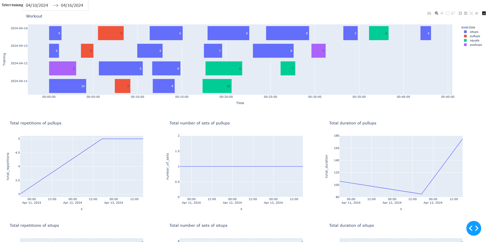

# Training dashboard

Very very basic dashboard to summarize my exercise logs, treat it as an inspiration, but I will improve it over time.

1. import "Log exercises.flo" flow in Automate Android app.
2. after you do your exercise, sync logs
3. change config.ini.example with correct logs directory and rename to config.ini
3. run python dashboard.py

you can see timeline of your training and some basic statistics per exercise
you can also select a date range

note: I'm not that fit, logs in this repo are pre-generated ;)